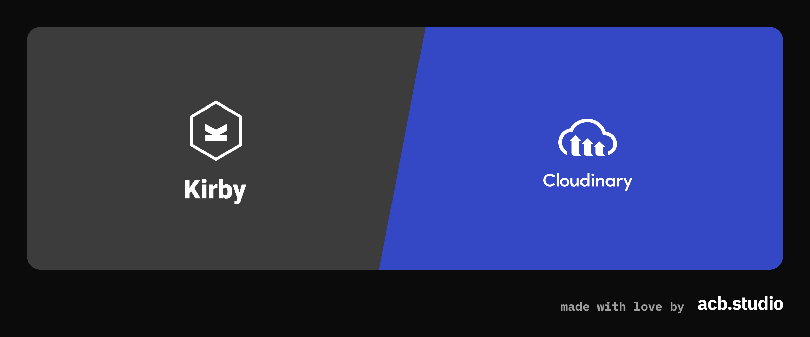

# Kirby CMS → Cloudinary sync plugin

[](https://opensource.org/licenses/MIT)  

[](https://acb.studio/)

## What is this?

This [Kirby](https://getkirby.com/) [plugin](https://plugins.getkirby.com/) allows you to automatically push your media assets to [Cloudinary](https://cloudinary.com/) when you upload them in Kirby. Instead of serving the assets from your Kirby server, they will be served by Cloudinary (the files' `url` will automatically point to Cloudinary).

## Who are we?

We ([acb.studio](https://acb.studio/)) are your partner for _sustainable_ digital products and products. We are a [Certified Kirby Partner](https://getkirby.com/partners/acb-studio).

## First steps

### Step 1: Install the plugin

```sh
$ composer require acb-studio/kirby-cloudinary-sync
```

### Step 2: Get Cloudinary API credentials

Head over to https://console.cloudinary.com/settings/api-keys and generate a new API key.

You will need three things to use this plugin:

- API key: You will see this right after generating your new API key
- API secret: In the column next to the API key, click on the "eye" icon to reveal your API secret
- Cloud name: It's printed on the top of the page

### Step 3: Configure the plugin

Open your Kirby `site/config/config.php` and add the configuration to it. See below for examples.

#### Step 3 - Example A: Minimal configuration

In this example, you just want to sync your image files with Cloudinary. A copy of your assets should be kept on your local machine as a backup. It is most likely a bad idea though to hard-code your Cloudinary API secrets in your `config.php`, so this is mainly suitable for local testing - see below for a more comprehensive configuration using environment variables.

Add this to your `site/config/config.php`:

```php
// ... your other configuration ...
'acb' => [
    'cloudinary' => [
        'key' => 'MY_CLOUDINARY_KEY',
        'secret' => 'CLOUDINARY_SECRET',
        'cloud' => 'CLOUDINARY_CLOUD_NAME',
        'assetTypes' => ['image'],
    ],
],
// ... your other configuration ...
```

#### Step 3 - Example B: Comprehensive configuration

- In this example, you make use of the [Kirby DotEnv plugin](https://plugins.getkirby.com/bnomei/dotenv) (optional). In your production environment (server), you use global environment variables and for local development, you prefer a (git-ignored) `.env` file. → `key`, `secret` and `cloud` attributes can be defined as a function
- You want to upload your images, videos and PDF files to Cloudinary. → `assetTypes` attribute
- You have a lot of images and some bigger videos - to save space on your local disk (and to not push all these files to git), you want your local files to be automatically replaced with empty placeholder files once they were uploaded to Cloudinary. → `removeAssetsLocally` attribute
- You want an admin area (accessible in the panel as admin from the left sidebar) allowing you to bulk-push all files that were not uploaded to Cloudinary, yet. You may also want an option to bulk-pull all files from Cloudinary (this will download the files from Cloudinary and replace your local empty placeholder files with the original ones, then delete (!) the assets on Cloudinary) → `adminArea` attribute
- You already want to optimize your images ahead of time (eager transformations) so they are available quicker the first time they are requested. → `eagerTransformations` attribute
- You want to customize the file naming (public ID) schema on Cloudinary. → `publicId` attribute

```php
// ... your other configuration ...
'acb' => [
    'cloudinary' => [
        'key' => fn() => getenv('CLOUDINARY_KEY') ?: env('CLOUDINARY_KEY'),
        'secret' => fn() => getenv('CLOUDINARY_SECRET') ?: env('CLOUDINARY_SECRET'),
        'cloud' => fn() => getenv('CLOUDINARY_CLOUD_NAME') ?: env('CLOUDINARY_CLOUD_NAME'),
        'assetTypes' => ['image', 'video', 'pdf'],
        'removeAssetsLocally' => true,
        'adminArea' => true,
        'eagerTransformations' => fn() => [
            ['format' => 'webp', 'quality' => 'auto:eco'],
            ['format' => 'avif', 'quality' => 'auto:eco'],
        ],
        'publicId' => fn($file) => implode('.', array_slice(explode('.', $file->id()), 0, -1))
    ],
],
// ... your other configuration ...
```

### Step 4: Add file blueprint

To have more control over your assets, you may want to add a Cloudinary [file blueprint](https://getkirby.com/docs/reference/panel/blueprints/file). Have a look at `cloudinary-file.yml` as an example how such a blueprint can look like. You can either copy-paste the fields into your own file blueprint or you can use the automatically registered `cloudinary` blueprint for your files (in your `files` field, set `template: cloudinary`). Some of the fields make use of the [Kirby k3-whenquery plugin](https://github.com/rasteiner/k3-whenquery). It is optional to add that plugin to your project, it just hides fields that are not relevant for more convenience.

### Step 5: Previously uploaded files

Files added to Kirby prior to installing the plugin are not automatically synced to Cloudinary. They can be manually pushed by opening the file in the panel (after doing step 4 first so that the blueprint contains the action) and then clicking the corresponding button to push the file, or by opening the "Cloudinary Admin" area on the left side (if enabled) and selecting "Push all files to Cloudinary" (depending on the number and size of assets this can take a long time and even fail based on the PHP timeout settings - in that case, you can always click the button again because it will only push files that were not already pushed, yet).

## Contribute

Feedback and contributions are welcome!

For commit messages we're following the [gitmoji](https://gitmoji.dev/) guide. 😃
Below you can find an example commit message for fixing a bug:

🐛 fix eager transformations

Please post all bug reports in our issue tracker.
